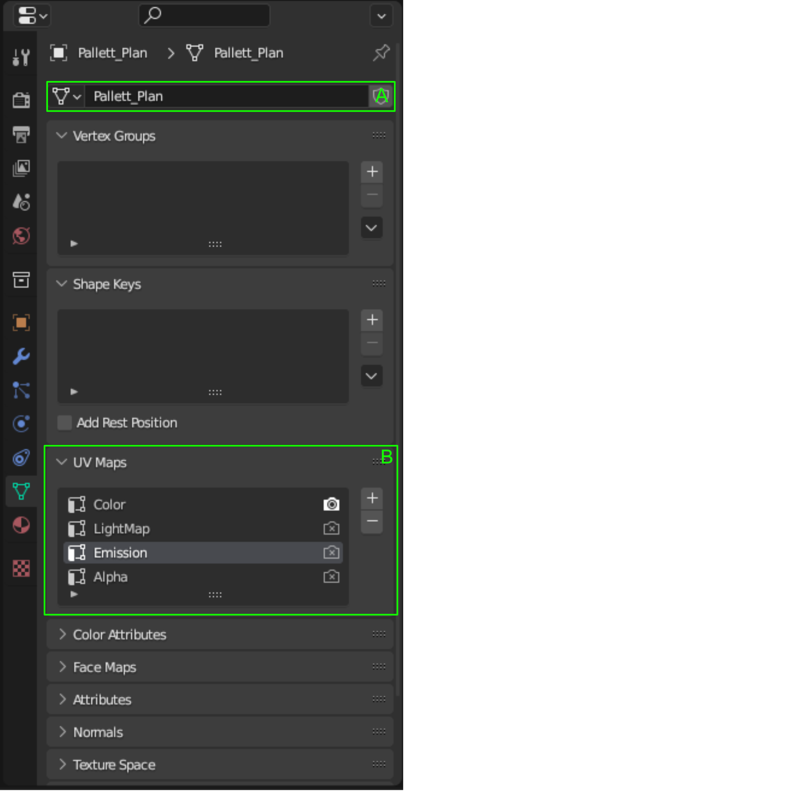

[Home](../../README.md)/[Asset Creation Workflow](./AssetCreationWorkflow.md)

# Project Pages
- [Home](../../README.md)
- [Asset Creation Workflow](./AssetCreationWorkflow.md)
- [Coding And Asset Standards](./CodingAndAssetStandards.md)
- [Instalation](./Instalation.MD)
- [Mechanic Creation](./MechanicCreation.md)
- [Project Layout](./ProjectLayout.MD)
- [Tools Instalation And Requirements](./ToolsInstalationAndRequirements.md)
- [Game Design Document](../GDD/GameDesignDocument.MD)
    - [Art Style](../GDD/ArtStyle.MD)
    - [Bonus Cards](../GDD/BonusCards.MD)
    - [Endless Mode](../GDD/EndlessMode.md)
    - [Gameplay](../GDD/Gameplay.MD)
    - [Sound Design](../GDD/SoundDesign.MD)
    - [Story](../GDD/Story.MD)
    - [Weapons And Armor](../GDD/WeaponsAndArmor.MD)

** To Do **
## Texturing
### Texture Naming
|Map|Prefix|Name|Suffix|Resolution Ratio|
|---|---|---|---|---|
|Color|Tex_|* Material Name *|_Col|1X1|
|Base Color|Tex_|* Material Name *|_Col|1X1|
|Albedo|Tex_|* Material Name *|_Col|1X1|
|Normal|Tex_|* Material Name *|_Norm|2X2|
|Height|Tex_|* Material Name *|_HGT|1X1|
|Roughness|Tex_|* Material Name *|_Rou|1X1|
|Smoothness|Tex_|* Material Name *|_SMO|1X1|
|Metallic|Tex_|* Material Name *|_Met|1X1|
|Metalness|Tex_|* Material Name *|_Met|1X1|
|Specular|Tex_|* Material Name *|_Spc|1X1|
|Anisotropic|Tex_|* Material Name *|_Ani|1X1|
|Anisotropic Rotation|Tex_|* Material Name *|_AnR|1X1|
|Sheen|Tex_|* Material Name *|_Shn|1X1|
|Clearcoat|Tex_|* Material Name *|_CC|1X1|
|Clearcoat Roughness|Tex_|* Material Name *|_CCR|1X1|
|IOR|Tex_|* Material Name *|_IOR|1X1|
|Transmission|Tex_|* Material Name *|_Trn|1X1|
|Transmission Roughness|Tex_|* Material Name *|_TrR|1X1|
|Emission|Tex_|* Material Name *|_Em|0.5X0.5|
|Emission Strength|Tex_|* Material Name *|_EmS|1X1|
|Alpha|Tex_|* Material Name *|_Alh|1X1|
### Resolution
|Model Type|Max Resolution|Expected Resolution|Min Resolution|
|---|---|---|---|
|Character|4096X4096|2048X2048|2048X2048|
|Character Props|2048X2048|1024X1024|512X512|
|ENV Props|2048X2048|1024X1024|512X512|
|Sprites|512X512|32X32|4X4|

## modeling

- A
    - Ensure your mesh is named correctly
    - Add the correct prefix && Suffix ([CodingAndAssetStandards](CodingAndAssetStandards.md))
- B
    - Create the correct UV channels
        - <b>Color</b> - This channel should only be used for the color map.
        - <b>LightMap</b> - This channel is used internally in Unity, it is used for baked light data.
        - <b>Emission</b> - This channel is used for the emission map.
        - <b>Alpha</b> - This channel is used for transparency, and uses an alpha map.

** To Complete **

docker run -d --name jellyfin --restart unless-stopped -p 8096:8096 -p 8920:8920 -v jellyfin-config:/config -v E:/Media:/media jellyfin/jellyfin